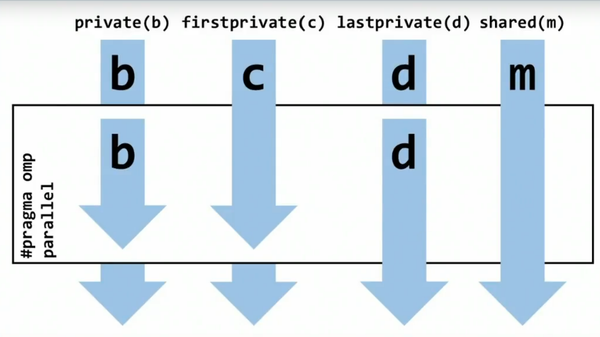

# OpenMP Fundamentals

## Basic Usage

- Include OpenMP library: `#include <omp.h>`
- Begin compiler directive using: `#pragma omp <construct> <clause()>`
- Compile using `g++ -fopenmp -o main main.cpp` or any other compatible compiler equivalent.
- Most omp constructs apply to the immediate next structured block.
- It is ok to have an `exit()` in a structured block.

## Concepts

1. OpenMP is a multi-threading, shared address model. This means that threads communicate by **sharing variables*.
1. Unintended sharing of data causes race conditions: when the program's outcome changes as the threads are scheduled differently. (the threads "race" against each other to modify the same variable)
1. To control race conditions: use synchronization to protect data conflicts.
1. BUT synchronization is expensive, so it is better to change how data (certain variables) is accessed to minimize the need for synchronization.
    - using `data sharing attribute clauses` such as - `default(none)` `private(x)` `firstprivate(x)` `lastprivate(x)` `shared(x)` `reduction()`
1. For inevitable synchronization, use `synchronization clauses` - `critical()` `atomic()` `ordered()` `barrier()` `nowait()`
1. To specify limits on threading, use `scheduling clauses` -  `schedule(type, chunk)` where type can be `static`, `dynamic`, or `guided`
1. Datacopying
1. `flush` and `master`
1. Multithreading explained:
    - A method of parallelizing where a primary thread (thread ID: `0`) is forked into subthreads, then the system divides the task among them. These threads run concurrently, where the runtime environment allocated threads to different processor cores.
    - At completion of the parallelized code, the threads join back together into the primary thread, after which it resumes the program on that single thread.
    - Threads are allocated to processors during runtime depending on usage, machine load, and other factors.

## Sources

- https://en.wikipedia.org/wiki/OpenMP
- https://www.youtube.com/watch?v=DjEbLYVofRA
- https://www.youtube.com/watch?v=_1QNzaWPYOE (OpenMP_vars.png)
